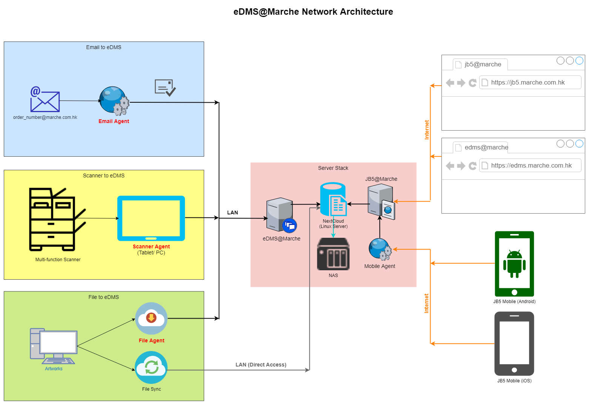

eDMS

------

### 2022.02.15 paulus 更新：

1. NextCloud

用 NC23 ，因為 [FullTextSearch 已經支持 ES7](https://github.com/nextcloud/fulltextsearch_elasticsearch/releases/tag/23.0.0)。

2. ElasticSearch

用 ES7 因為 [ES8 改咗啲 REST API](https://www.elastic.co/guide/en/elasticsearch/reference/current/release-highlights.html#_7_x_rest_api_compatibility) 我唔想冒險，都係保守啲好。

------

#### 先睇成個 eDMS 概念圖：

正中心嘅係隻 eDMS Server，存入嚟而又要做前期處理嘅檔案有 3 樣嘢（圖左方）：

* Email Agent
  處理 emails 同隨 emails 而來的 attachments
* Scanner Agent
  處理經 scanner 出嚟嘅 PDF 檔案
* File Agent
  處理其他來源嘅 PDF 檔案，例如 designer 同事所造出嚟的 PDF

有咗一大堆檔案之後就係點樣可以搜索出你想要搵嘅檔案（圖右方）：

* JB5 系統
  理想情況係可以喺 JB5 (jb5.marche.com.hk) 之內搜索出相關嘅 eDMS 檔案
* eDMS 系統
  同樣，理想情況係可以喺 eDMS 之內搜索出同 JB5 相關嘅 eDMS 檔案，例如以 Job Number 搜索
* Mobile 設備
  喺  Mobile JB5 都可以 search 啲  eDMS 檔案

#### 再睇 Servers 結構圖：

------

<mark>2022.02.15 paulus: 由 ESXi 改為 Proxmox</mark>

------

個底層係隻 DELL C6100 其中 1 隻 Node，有 64 GB RAM 任用，目前分配 32GB 俾 Docker，Storage 隨便你俾，暫時 Docker 用 Synology 有 ４TB。

- Portainer
  用嚟 mon 住隻 docker
- nginx （冇整埋同一隻 docker，另外搞，去睇 ``install/01_nginx_reverse_rpoxy.md``）
  用嚟做 reverse proxy，保住其他 containers，唔好咁易俾人 hack 到啲 servers
- Let's Encrypt（跟 reverse proxy 另外搞）
  用嚟做 SSL Certification，如果用到 SSL 就唔使年年俾 SSL 牌照錢
- Postgres
  又叫 PostgreSQL，係 database，裝住 NextCloud 所有 data，可以改用 MySQL，不過 postgres 係首選
- NextCloud
  係主角，開源 dms
- ElasticSearch
  係二號主角，負責做 content search，allocate 咗 16GB RAM 俾佢用（係隻 docker 嘅一半 memory，可知佢幾重要）

如果全部都用 VM 就會比較麻煩，裝機都裝到手軟，而且`第一輪注定要推倒重來`，用 Docker 加 docker-compose 可以快捷好多。

## 
