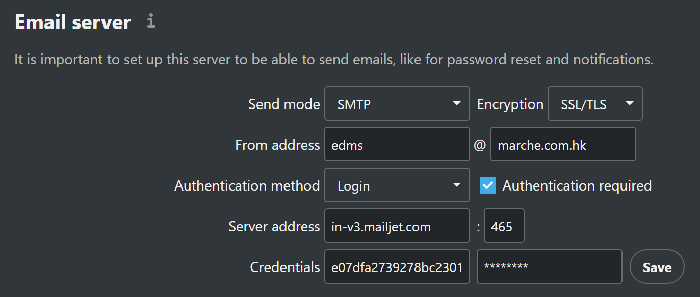
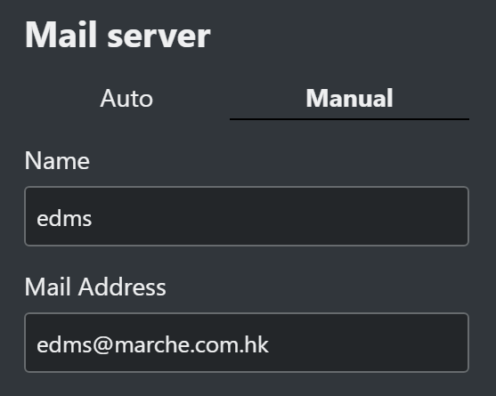
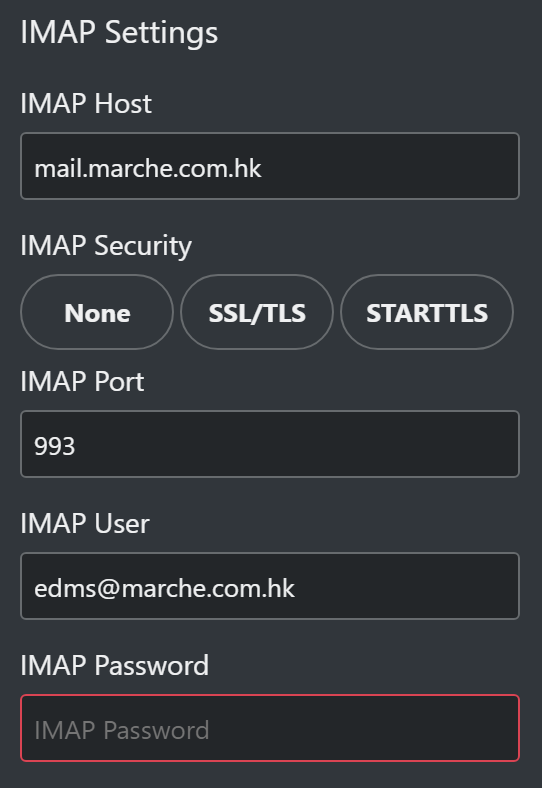
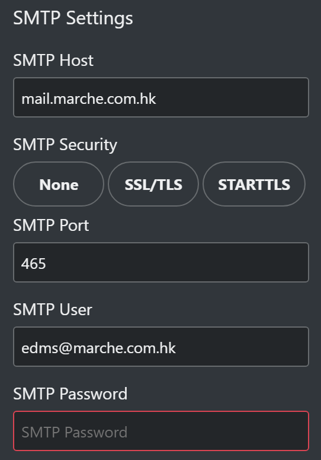

[HowTo Integrate Email](https://www.inmotionhosting.com/support/website/integrate-email-in-nextcloud/)

點樣設定可以睇上面嘅 link 作為參考，我就唔寫咁多，雖然 NextCloud 可以 connect 不同嘅 email provider，不過，如果有時間，我想多裝一隻 [iRedMail Server](https://www.iredmail.org/) 直接喺 eDMS 內收發 emails，咁先至係最高境界。

[Files From Mail](https://github.com/nextcloud/files_frommail)

可以用嚟將啲 attachment 存入 NextCloud 成為 upload 檔案，結合 [Files Automated Tagging](https://apps.nextcloud.com/apps/files_automatedtagging) 分門別類，不過，較好嘅選擇係自己察 code，整番隻 MailAgent，講到 MailAgent 咁就係另一個大題目，要另外寫一章。

#### [Mailjet](https://www.mailjet.com/)

係用嚟做 broadcast email 服務，雖然我哋唔使用到 broadcast，不過會要用到：

- password lost & found
- share by email
- email notifications
- etc

有好多名牌揀，不過，MailJet 佢個免費版有 6,000 per month/ 200 per day，係目前最大方嘅 plan，應該夠用，無謂浪費買啲用唔著嘅服務！

NextCloud settings:

啲參數喺個 Mailjet account 有，自己登入去抄。

#### 設定個人嘅 mail box 資料

下面係 edms@marche.com.hk 嘅設定，當係 example，你要改為自己個 email 同埋 password：

------

#### 2022.02.15 paulus:

NC23 我選用 Auto 可以成功設定個人 email

------

