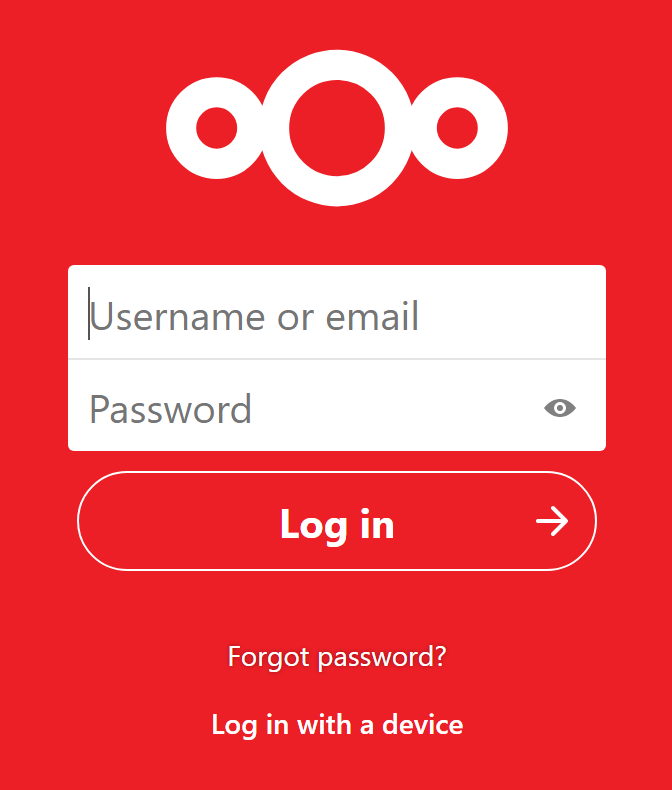
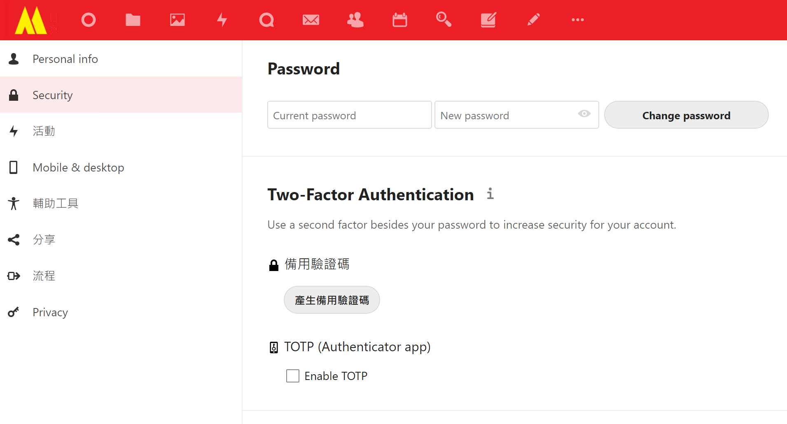
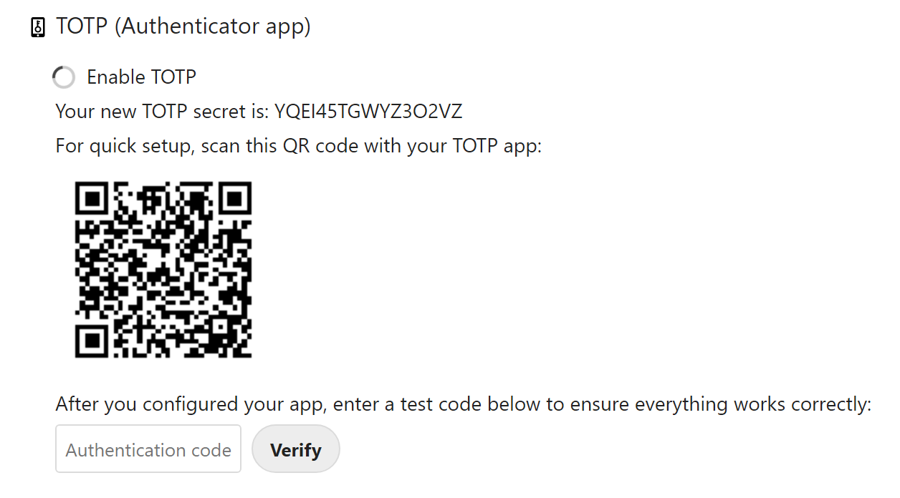

### 2FA Login

除咗傳統嘅 login 畫面：

eDMS (其實係 NextCloud) 提供 2FA（Two-Factor Authentication）App 叫 [TOTP](https://apps.nextcloud.com/apps/twofactor_totp)，安裝後用戶第一次登入第一件事就係去啟動 2FA，步驟如下：

* 首先用戶要喺自己部手機安裝 Google Authenticator ([Android](https://play.google.com/store/apps/details?id=com.google.android.apps.authenticator2&hl=en&gl=US)/ [iPhone](https://apps.apple.com/us/app/google-authenticator/id388497605))

* 登入咗 eDMS 之後，去 click 右上角自己個圖像，Settings > Security

* check Enable TOTP
  
  

* 畫面出現個 QR Code，喺 Google Authenticator 加一個新 record，然後 scan 個 QR Code
  
  

* Google Authenticator 會出個 6 位數字，輸入個數字，然後 click Verify

* 完成後，當你登入 eDMS 嘅時候，如果問你要 verification code 你就打開手機 Google Authenticator，將 Authenticator 顯示嘅數字輸入，咁就完成 2FA 登入

* <mark style="background-color: red">建議如果 eDMS 容許 internet 登入，就最好係啟用 TOTP，多行一步就多一分安全感</mark>
