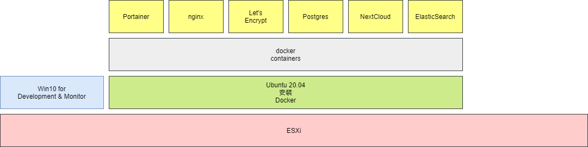

edms@marche

先睇結構圖:

個底層係隻 DELL C6100 其中 1 隻 Node，有 64 GB RAM 任用，目前分配：16GB 俾 Win10，32GB 俾 Docker，Storage 暫時 Docker 用 Synology 得 1TB，隻 Win10 用咗 local 200GB 嘅 SSD，可以快啲爽啲。

- Portainer
  用嚟 mon 住隻 docker
- nginx
  用嚟做 reverse proxy，保住其他 containers，唔好咁易俾人撞到啲 servers
- Let's Encrypt
  用嚟做 SSL Certification，如果用到 SSL 就唔使年年俾 SSL 牌照錢
- Postgres
  又叫 PostgreSQL，係 database，裝住 NextCloud 所有 data，可以改用 MySQL，不過 postgres 係首選
- NextCloud
  係主角，開源 dms
- ElasticSearch
  係男二，負責做 content search，allocate 咗 16GB RAM 俾佢用（係隻 docker 嘅一半 memory，可知佢幾重要）

如果全部都用 VM 就會比較麻煩，裝機都裝到手軟，而且`第一輪注定要推倒重來`，用 Docker 加 docker-compose 可以快捷好多。仲欠幾隻 VM，遲啲先出場，到時再介紹。

## Table of Contents:

### 1. [Windows 10 VM](./Windows-10-VM.md)

### 2. [Servers/ edms VMs](./Servers-edms-VMs.md)

### 3. [Online Service Accounts](./Online-Service-Accounts.md)

### 4. [Mail Client Manual Settings](./Mail-Client-Manual-Settings.md)

### 5. [SSH](./SSH.md)

### 6. [DNS](./DNS.md)

### 7. [161-edms-win10](./161-edms-win10.md)

### 8. [030-edms-docker](./030-edms-docker.md)

### 9. [ElasticSearch](./ElasticSearch.md)

### 10. [NextCloud](./NextCloud.md)

### 11. [SSL with Let's Encrypt](./SSL-with-Lets-Encrypt.md)

------

## [Video Tutorials](./video-tutorials.md)

------

To access edms@marche:

內網：http://edms.marche/

外網：http://edms.marche.com.hk　為咗方便測試，會暫時開放，遲啲會關閉。